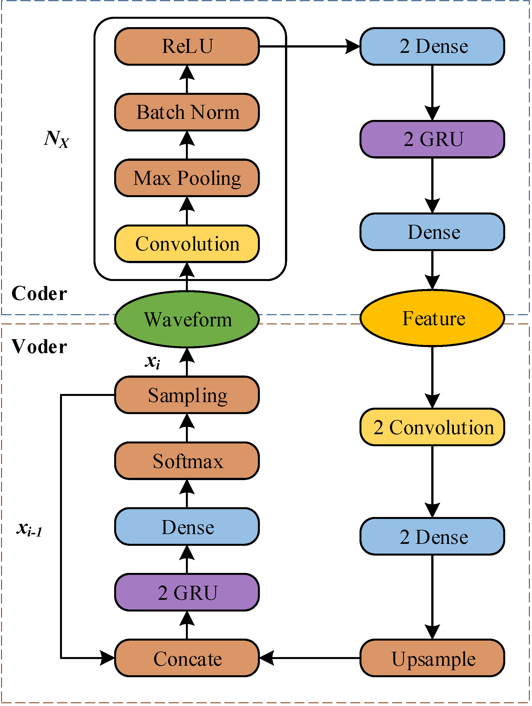

# RawNet: Fast End-to-End Neural Vocoder

Samples of Paper [RawNet: Fast End-to-End Neural Vocoder](few), which is submitted to Interspeech 2019. 

RawNet, is a truly end-to-end neural vocoder, which use a coder network to learn the higher representation of signal, and an autoregressive voder network to generate speech sample by sample. The coder and voder together act like an auto-encoder network, and could be jointly trained directly on raw waveform without any human-designed features.

More detail is explained in the paper.

Code will be released soon...

## Samples

In the `RawNet samples` directory, you can find the demo samples generated by RawNet.

## Author

Yunchao He

yunchaohe@gmail.com
